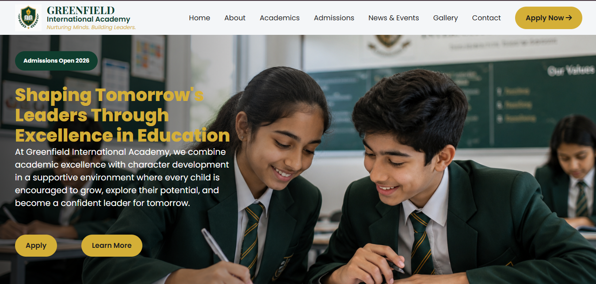

# 🎓 Greenfield International Academy

A modern, responsive multi-page school management website built as part of an AI Web Development Capstone Project.

The website showcases Greenfield International Academy through a professional user interface that provides information about the school, academics, admissions, news, gallery, and contact details while delivering a responsive user experience across desktop, tablet, and mobile devices.

---

## 📖 Overview

Greenfield International Academy is a fictional private school website created to demonstrate modern front-end web development skills using HTML, CSS, and JavaScript.

The project focuses on clean design, responsive layouts, accessibility, reusable components, and realistic user interactions.

---

## 📸 Preview




---

## 🚀 Live Demo

**Website**

https://greenfield-academy.netlify.app

---

## 💻 GitHub Repository

https://github.com/Ace-genesis/green-field-academy

---

## ✨ Features

- Responsive design for desktop, tablet, and mobile
- Multi-page website
- Reusable navigation and footer
- Interactive mobile navigation
- Google Maps integration
- Image gallery
- Admissions information
- Frequently Asked Questions (FAQ)
- News & Events section
- Contact form
- Newsletter subscription form
- Modern animations and hover effects
- Semantic HTML5 structure
- Organized CSS architecture
- JavaScript-powered interactions

---

## 📄 Pages

- Home
- About
- Academics
- Admissions
- News & Events
- Gallery
- Contact

---

## 🛠️ Built With

- HTML5
- CSS3
- JavaScript (ES6)
- Google Fonts
- Font Awesome
- Google Maps Embed
- Netlify (Deployment)
- Git & GitHub

---

## 📁 Project Structure

```text
greenfield-academy/
│
├── index.html
├── about.html
├── academics.html
├── admissions.html
├── news.html
├── gallery.html
├── contact.html
│
├── css/
│   ├── style.css
│   ├── header.css
│   ├── hero.css
│   ├── about.css
│   ├── academics.css
│   ├── admission.css
│   ├── news.css
│   ├── gallery.css
│   ├── footer.css
│   └── responsive.css
│
├── js/
│   └── script.js
│   └── ui.js
│
├── assets/
│   ├── images/
│   └── logos/
│
└── README.md
```

---

## 🎯 Project Objectives

This project was developed to:

- Practice responsive web design
- Build a complete multi-page website
- Apply semantic HTML5
- Improve CSS layout skills using Flexbox and Grid
- Implement JavaScript interactivity
- Create reusable UI components
- Learn deployment using Netlify
- Use AI tools to assist in planning, design, content creation, and asset generation

---

## 👤 Author

**Ace Genesis**

Front-End Web Developer

GitHub:
https://github.com/Ace-genesis

Email:
adrielokpalo@gmail.com

---

## 📜 License

This project was created for educational purposes as part of the Web Development Capstone Project.